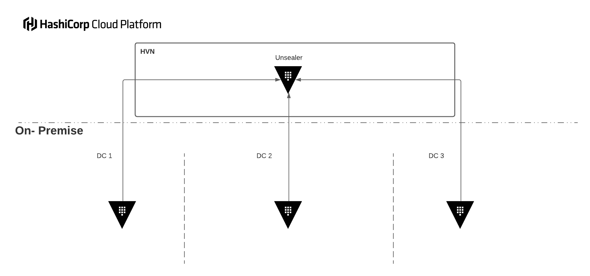

# Hybrid HCP Vault Autounseal

This architectural pattern explores using HCP Vault to implement autounseal for on-premise Vault clusters.  Whilst there are many options for implementing autounseal in Vault, this pattern could represent an entry point for organisations wishing to begin a HashiCorp Cloud strategy.

Implementing this architectural pattern could represent the beginning of a trust that organisations will need to implement a HashiCorp Cloud strategy.

### Concept

In this Pattern, the HCP Vault cluster acts as the unsealer for on-premise Vault clusters.

### Proof of Concept

This repo contains a proof of concept for for this pattern, written in both bash and Terraform.  It will configure the HCP Vault with the transit secrets engine, generate a key for encrypting Vault's data, create a policy and a token with the policy attached.

>### WARNING
>
> This is just a proof of concept. This code should be considered unsafe for production. If you wish to implement this pattern, take steps to implement protective measures against tokens being leaked in plaintext.

Both implementations will output a file which contains the seal stanza required to add to your Vault config files. This will enable autounseal on your on-premise clusters.

>### Bash
>
>Note: The bash implementation uses the Vault API to make its calls to HCP Vault.

